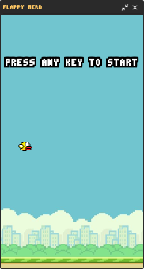
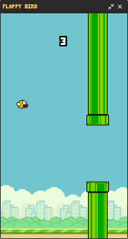
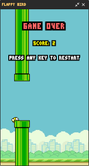

# Flappy Bird

Flappy Bird game made with **JFrame** in **Kotlin**.

This is a simple **Game Project** to my portfolio, I learned the basics of JFrame and improved my Kotlin skills.

  
  
  

 

> Based on: [Code Flappy Bird in Java - Kenny Yip Coding](https://www.youtube.com/watch?v=Xw2MEG-FBsE)
>
> But in **Kotlin** and in my style of coding.

 

---

## 📑 Table of Contents

- [Requirements](#-requirements)
- [How to install](#-how-to-install)
- [Author](#-author)
- [License](#-license)

---

## 📋 Requirements

- Java, which can be installed at: **https://www.java.com/en/download/**

---

## 📥 How to install

The `.jar` file is available on Releases.

- Check [Requirements](#-requirements) first;
- Click here to redirect: **[Releases Page](https://github.com/ryandvl/flappy-bird/releases/latest)**;
- Download the `.jar` file and place it in any folder;
- Done! Just open the file and play it.

 

Or you can download the source code and build.

---

## 🧑‍💻 Author

|  |
| :---: |
| **[ryandvl](https://github.com/ryandvl)** |

---

## 📝 License

This repository is licensed under the MIT License. See the [LICENSE](LICENSE) file for more details.
